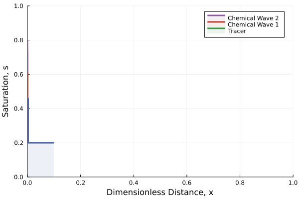

# [AnalyticalEOR.jl](https://github.com/rlarao/AnalyticalEOR.jl)

A [Julia](http://julialang.org) package with analytical solutions to Enhanced Oil Recovery (EOR) methods.



## Installation
The latest version of AnalyticalEOR.jl can be installed via the built-in package manager in Julia.

```julia
julia>]
(v1.6) pkg> add https://github.com/rlarao/AnalyticalEOR.jl
(v1.6) pkg> instantiate
```

For development purposes, clone the AnalyticalEOR.jl repository to `~/.julia/dev/`
```shell
~/.julia/dev: git clone https://github.com/rlarao/AnalyticalEOR.jl
```

Then use `dev` to add AnalyticalEOR to Julia's path

```julia
julia>]
(v1.6) pkg> dev AnalyticalEOR
(v1.6) pkg> instantiate
```

